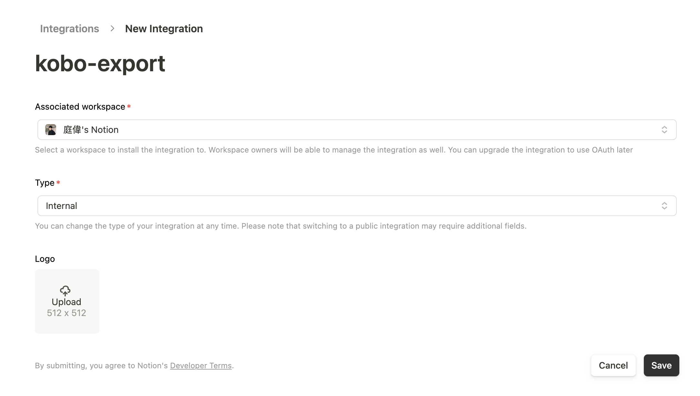
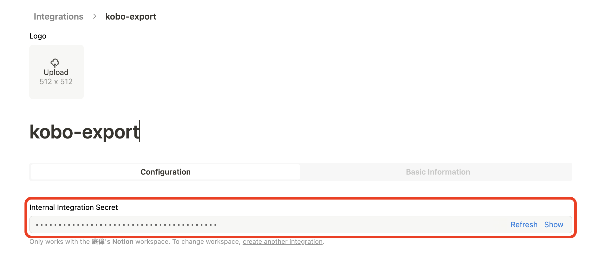
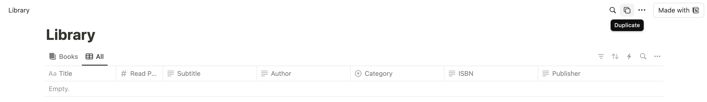
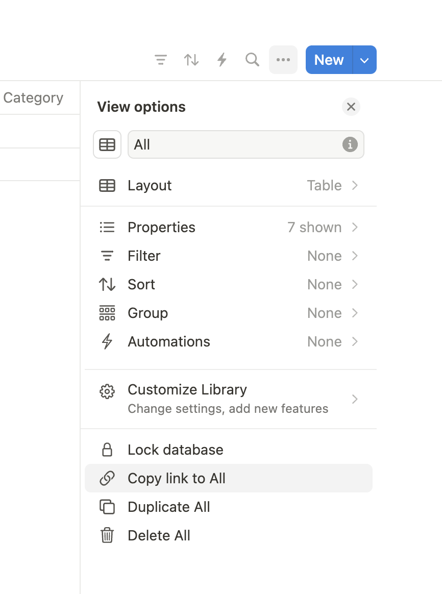
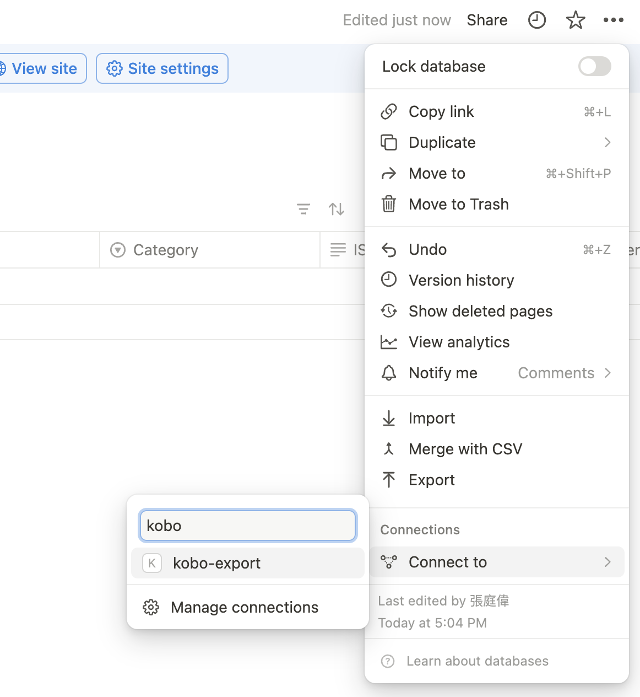
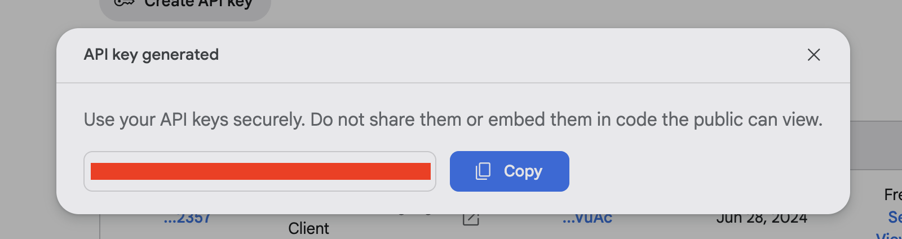

# Kobo2Notion

## Introduction
Kobo2Notion is a Python-based tool that extracts bookmark data from Kobo e-readers and seamlessly uploads it into your Notion database. Additionally, it can summarize bookmarks using Google Gemini. This project offers a cost-free alternative to existing solutions like Readwise, providing users with greater control over their reading data.

## Features
- Extract bookmarks from Kobo e-readers
- Upload bookmarks to a Notion database
- Summarize bookmarks using Google Gemini AI
- Free and open-source

## Prerequisites
- Python 3.11.9 or later (not tested on other versions)
- Kobo e-reader
- Notion account
- Google Cloud account (for Gemini API access)

## Installation
1. Clone the repository:
   ```bash
   git clone https://github.com/ghnmqdtg/Kobo2Notion.git
   cd Kobo2Notion
   ```

2. Install dependencies:
   ```bash
   pip install -r requirements.txt
   ```

## Configuration
1. Connect your Kobo e-reader to your computer.

2. Set the `SQLITE_SOURCE` to the path of the KoboReader.sqlite file.

3. Get the Notion API key

    1. Go to [Notion Integrations](https://www.notion.so/profile/integrations)

    2. Create a new integration named `kobo-export` and set associated workspace to your workspace.

    3. Click `Save`.

        <p align="left">
            
        </p>

    4. Click `Show` and copy the `SECRET` value.
        
        <p align="left">
            
        </p>
    
    5. Paste the `SECRET` value into the `NOTION_API_KEY` environment variable in `.env` file.

4. Get the Notion Database ID

    1. Duplicate the database template [here](https://ghnmqdtg.notion.site/4978bcc5eda847a59940f5cb4aff32d9?v=28a249bcfa92488889f3505127a8e1ef&pvs=4) to your workspace.

        <p align="left">
            
        </p>

    2. Click `Share` and copy the link.

        <p align="left">
            
        </p>
    
    3. Extract the `Notion Database ID` from the URL.

        For example, if the URL is `https://www.notion.so/ghnmqdtg/4978bcc5eda847a59940f5cb4aff32d9?v=28a249bcfa92488889f3505127a8e1ef&pvs=4`, the `Notion Database ID` is `4978bcc5eda847a59940f5cb4aff32d9`.

    4. Paste the `Notion Database ID` value into the `NOTION_DATABASE_ID` environment variable in `.env` file.

    5. Connect the database to the `kobo-export` integration.

        <p align="left">
            
        </p>

5. Get the Google Gemini API key [here](https://aistudio.google.com/app/apikey) (optional)

    > This is an optional feature if you want to summarize your bookmarks. The api for `gemini-1.5-flash` is free on Google AI Studio. If you don't need it, set `SUMMARIZE_BOOKMARKS` to `false` in `.env` file.

    Copy the `API Key` value into the `GEMINI_API_KEY` environment variable in `.env` file.

    <p align="left">
        
    </p>

6. Adjust any other settings in the `config.py` file. For example, you can change the prompt language to `en` for English.

## Usage
Run the export script:
```bash
python kobo2notion.py
```

## Contributing
Contributions are welcome! Please feel free to submit a Pull Request.

## License
This project is licensed under the [MIT License](LICENSE).

## Acknowledgements
- [mollykannn/kobo2notion](https://github.com/mollykannn/kobo2notion)
- [starsdog/export_kobo](https://github.com/starsdog/export_kobo)
- Notion for their API
- Google for the Gemini AI model

## Contact
For questions or support, please open an issue on the GitHub repository.