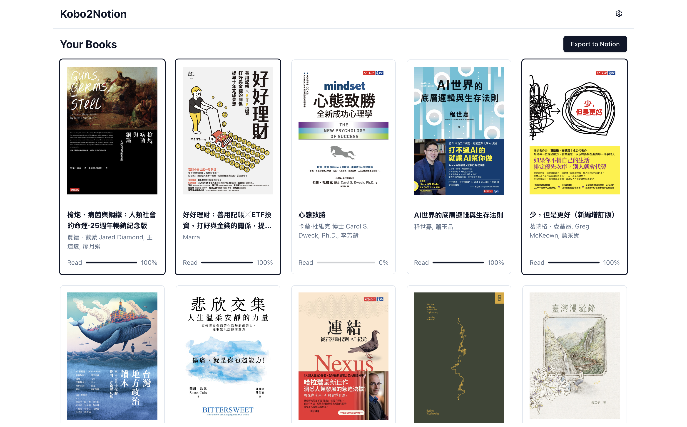
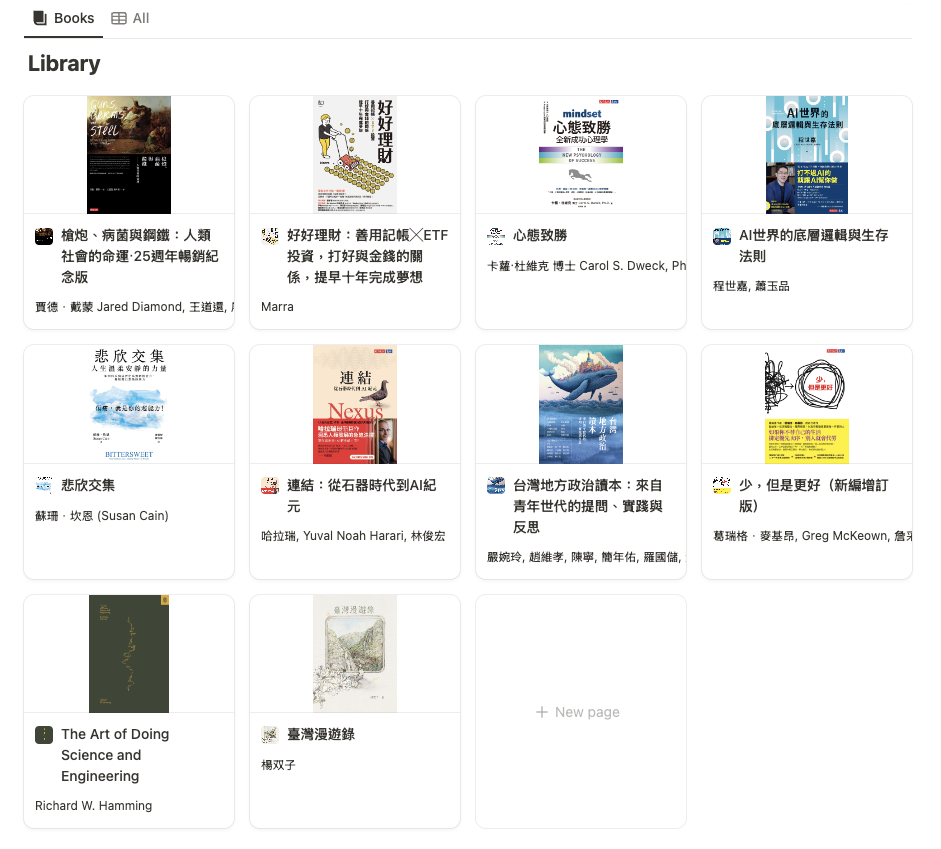
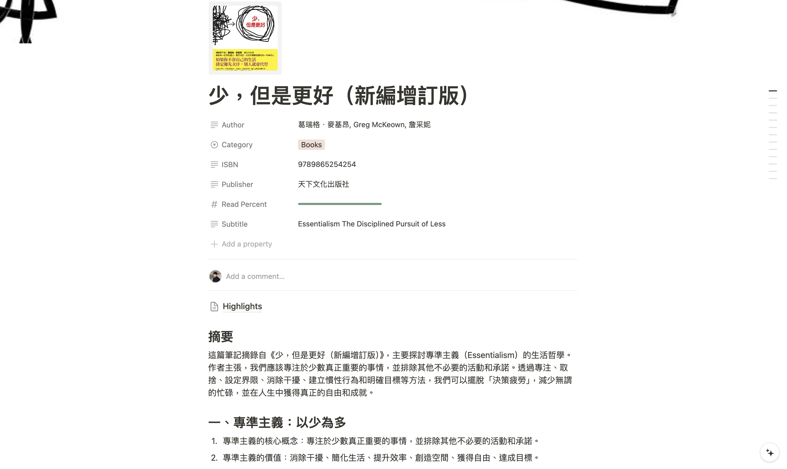
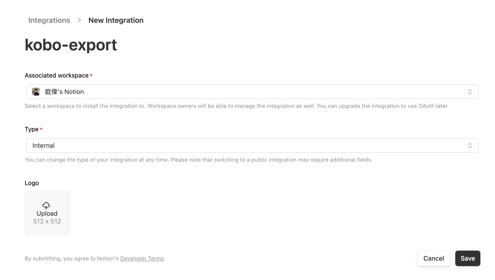
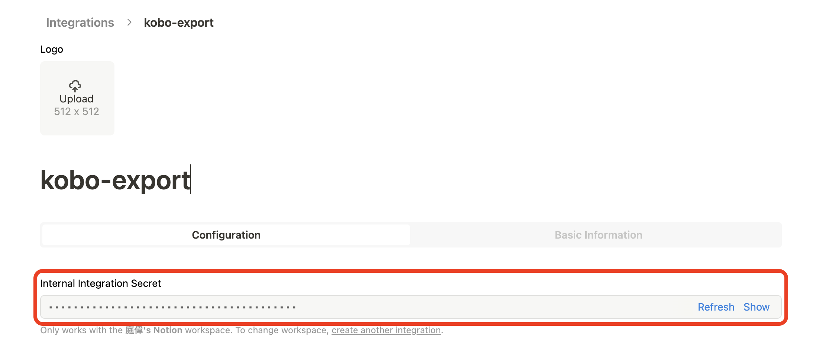
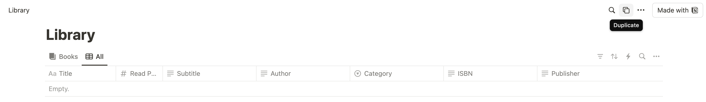
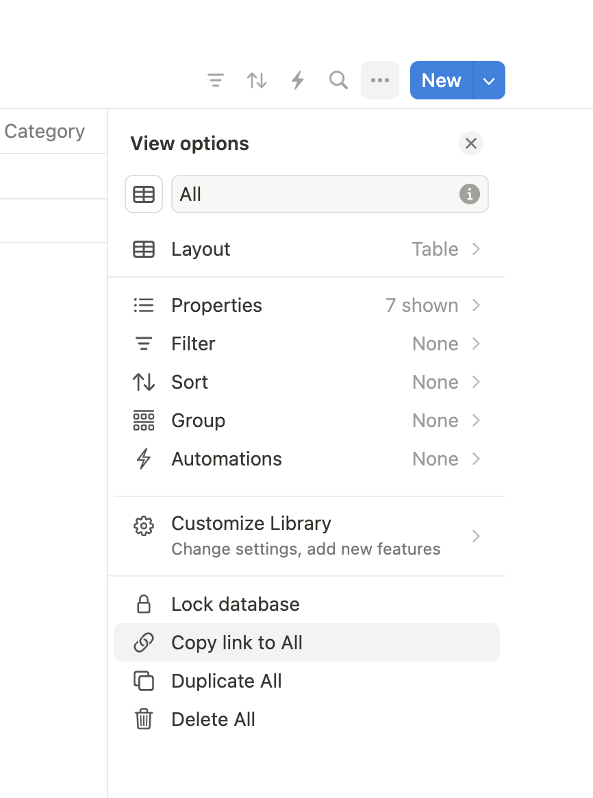
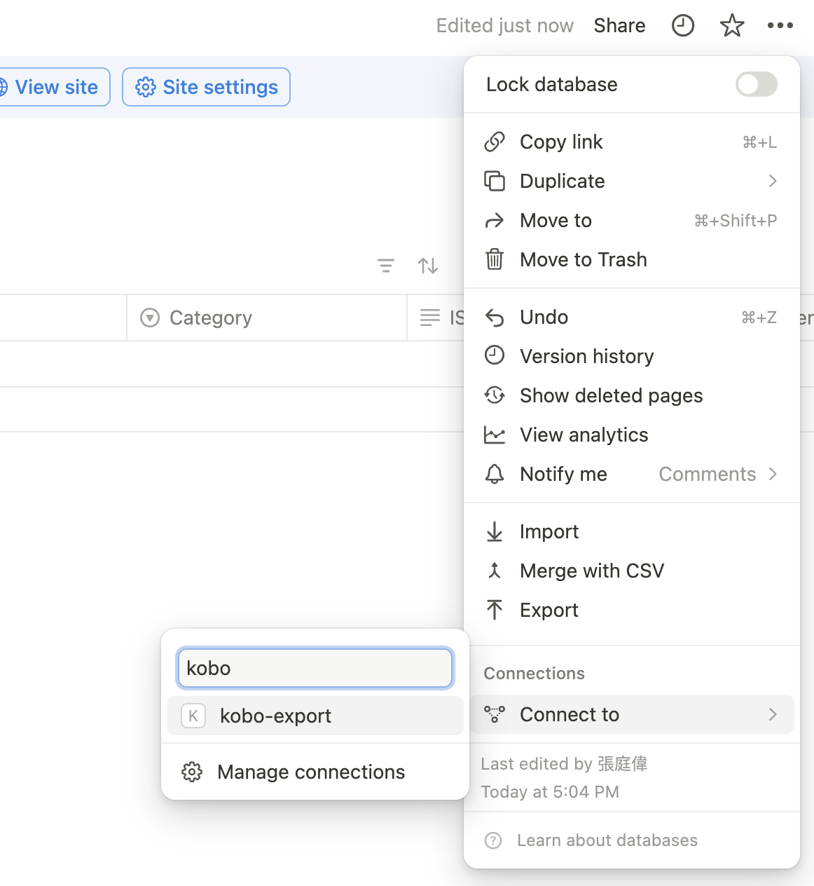
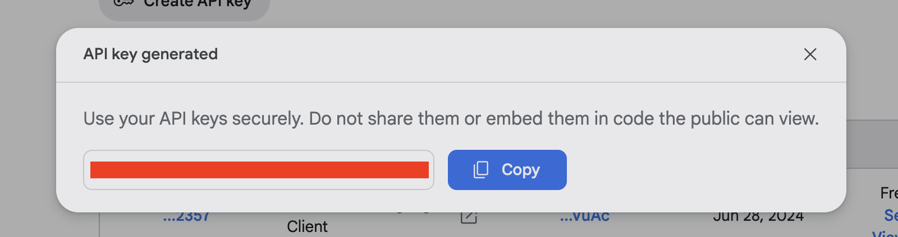

# Kobo2Notion

## Introduction
Kobo2Notion is an Electron application built with TypeScript and React that extracts bookmark data from Kobo e-readers and seamlessly uploads it into your Notion database. Additionally, it can summarize bookmarks using Google Gemini. This project offers a cost-free alternative to existing solutions like Readwise, providing users with greater control over their reading data.

> This app is still under development. Some features are not implemented yet.



## Features
- Extract bookmarks from Kobo e-readers
- Upload bookmarks to a Notion database
- Summarize bookmarks using Google Gemini AI
- Modern desktop interface built with Electron
- Free and open-source

## Prerequisites
- Node.js 18 or later
- Kobo e-reader
- Notion account
- Google Cloud account (for Gemini API access)

## Installation
1. Clone the repository:
   ```bash
   git clone https://github.com/ghnmqdtg/Kobo2Notion.git
   cd Kobo2Notion
   ```

2. Install dependencies:
   ```bash
   npm install
   ```

## Usage
1. Start the application in development mode:
   ```bash
   npm run dev
   ```

   Or build and run the production version:
   ```bash
   npm run build
   npm start
   ```

2. When you first launch the app, you'll be prompted to enter your configuration in the Settings page:
   - Kobo Highlights File Path (e.g., `/Volumes/KOBOeReader/.kobo/KoboReader.sqlite` on MacOS)
   - Notion API Key
   - Notion Database ID
   - Gemini API Key (optional, for bookmark summarization)
   > How can I get these values? Please refer to the [Configuration](#configuration) section.


3. After saving your settings, the application will display your Kobo library. Select the books you want to export and click the export button.

4. Check your Notion database to see the exported bookmarks and summaries.

    1. The overview of the library. You can see all the books you purchased.

        <p align="left">
            
        </p>

    2. Once you select and export a book, the application will start to extract the bookmarks and upload them to Notion.
    
        <p align="left">
            
        </p>
    
    3. The detail of the book. The original highlight is saved in `Highlight` page, and the summary is saved in the main page.
        
        <p align="left">
            
        </p>

## Building for Distribution
To build the application for your platform:

```bash
# For Windows
npm run build:win

# For macOS
npm run build:mac

# For Linux
npm run build:linux
```

## Configuration
Connect your Kobo e-reader to your computer before every time you launch the app.

1.  The path of the `KoboReader.sqlite` file
   - MacOS: `/Volumes/KOBOeReader/.kobo/KoboReader.sqlite`
   - Windows: Usually under the drive letter assigned to your Kobo device, e.g., `E:\.kobo\KoboReader.sqlite`

2. Notion API key

    1. Go to [Notion Integrations](https://www.notion.so/profile/integrations)

    2. Create a new integration named `kobo-export` and set associated workspace to your workspace.

    3. Click `Save`.

        <p align="left">
            
        </p>

    4. Click `Show` and copy the `SECRET` value.
        
        <p align="left">
            
        </p>

3. Notion Database ID

    1. Duplicate the database template [here](https://ghnmqdtg.notion.site/4978bcc5eda847a59940f5cb4aff32d9?v=28a249bcfa92488889f3505127a8e1ef&pvs=4) to your workspace.

        <p align="left">
            
        </p>

    2. Click `Share` and copy the link.

        <p align="left">
            
        </p>
    
    3. Extract the `Notion Database ID` from the URL.

        For example, if the URL is `https://www.notion.so/ghnmqdtg/4978bcc5eda847a59940f5cb4aff32d9?v=28a249bcfa92488889f3505127a8e1ef&pvs=4`, the `Notion Database ID` is `4978bcc5eda847a59940f5cb4aff32d9`.

4. Connect the your database to the `kobo-export` integration.

    <p align="left">
        
    </p>

5. Google Gemini API key [here](https://aistudio.google.com/app/apikey) (optional)

    > This is an optional feature if you want to summarize your bookmarks. The API for `gemini-1.5-flash` is free on Google AI Studio.

    <p align="left">
        
    </p>

## Contributing
Contributions are welcome! Please feel free to submit a Pull Request.

## License
This project is licensed under the [MIT License](LICENSE).

## Acknowledgements
- [mollykannn/kobo2notion](https://github.com/mollykannn/kobo2notion)
- [starsdog/export_kobo](https://github.com/starsdog/export_kobo)
- [huybn5776/Kobo bookmark](https://github.com/huybn5776/kobo-bookmark) (for using corsproxy to avoid CORS issues)
- Notion for their API
- Google for the Gemini AI model

## Contact
For questions or support, please open an issue on the GitHub repository.